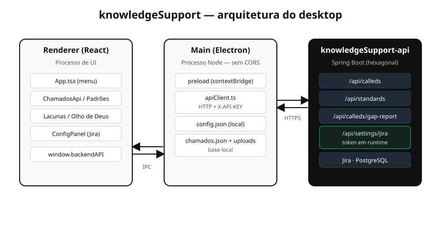

# Arquitetura — knowledgeSupport Desktop

Este documento descreve como o app de desktop é organizado e por quê. O foco é a separação
entre os processos do Electron e o fluxo de dados até a knowledgeSupport-api.



## Os três processos

O Electron separa o app em processos com responsabilidades distintas. Aqui eles mapeiam para
uma fronteira de segurança clara.

### Renderer (`src/`)

A interface React. É o único lugar com JSX e estado de UI. **Não** faz HTTP direto nem conhece
a `X-API-KEY` ou o token do Jira — tudo passa por `window.backendAPI`, `window.chamadosAPI`,
`window.passoAPassoAPI` e `window.bubbleAPI`, injetados pelo preload.

Componentes principais:

- `App.tsx` — máquina de estados da bolha (`colapsado → menu → painel`) e o menu de 7 itens.
- `components/OlhoDeDeus.tsx`, `ChamadoForm.tsx`, `ChamadoList.tsx` — base local de chamados.
- `components/ChamadosApi.tsx` — chamados do Jira (listar, analisar, feedback).
- `components/PadroesPanel.tsx` — CRUD de padrões + acurácia.
- `components/LacunasPanel.tsx` — relatório de lacunas.
- `components/ConfigPanel.tsx` — conexão com a API e token do Jira.

### Preload (`electron/preload.ts`)

A ponte. Usa `contextBridge` para expor um conjunto pequeno e explícito de funções ao
renderer, cada uma apenas repassando um `ipcRenderer.invoke`/`send` para um canal nomeado.
É o contrato entre UI e main — nada além do que está aqui atravessa a fronteira.

### Main (`electron/`)

O processo Node. Concentra tudo que é "sistema": janelas, arquivos e HTTP.

- `main.ts` — cria a janela (sempre **centralizada**, via `centeredBounds`), trata os canais
  da bolha (`bubble:*`), da base local (`chamados:*`) e do passo a passo (`passoAPasso:*`).
- `apiClient.ts` — o **adapter de saída**: o único lugar que conhece HTTP e a `X-API-KEY`.
  Toda chamada volta como `{ ok, data }` ou `{ ok, error }`, então uma exceção nunca cruza o
  IPC crua.

## Fluxo de uma chamada à API

```
Componente React
  → window.backendAPI.listCalleds()          (preload)
    → ipcRenderer.invoke('api:calleds:list')
      → apiClient: GET {apiUrl}/api/calleds   (header X-API-KEY)
        → knowledgeSupport-api → Jira
      ← ApiResult<CalledResponse[]>
```

Por que o HTTP fica no main e não no renderer? Dois motivos: **sem CORS** (o main é Node, não
navegador) e **sem vazamento de segredo** (a `X-API-KEY` fica no `config.json` do app, lido só
pelo `apiClient`; o renderer só vê resultados).

## Token do Jira em runtime

O token do Atlassian expira. Antes, trocá-lo exigia editar o `.env` da API e reiniciar. Agora
o painel **Configurações** chama `GET`/`PUT /api/settings/jira`, e a API troca as credenciais
em memória (com override persistido em disco). O token nunca volta pela interface — o `GET`
devolve apenas `tokenConfigured: true/false`. Do lado do desktop, isso são só mais dois canais
IPC (`api:settings:jira:get` / `:set`) em `apiClient.ts`.

## Onde os dados moram

- **Chamados locais** — `data/chamados.json` + anexos em `data/uploads/` (base offline, útil
  para o Olho de Deus).
- **Config do desktop** — `config.json` no `userData` (URL da API + `X-API-KEY`).
- **Chamados do Jira, padrões, feedback, lacunas** — na knowledgeSupport-api (Jira + PostgreSQL).

## Tipos como contrato

`src/api/types.ts` espelha os DTOs da API (fonte: `/v3/api-docs`). Se a API mudar um contrato,
este é o único arquivo de tipos a atualizar. `src/types/backend.d.ts` declara a superfície de
`window.backendAPI` a partir desses tipos.
